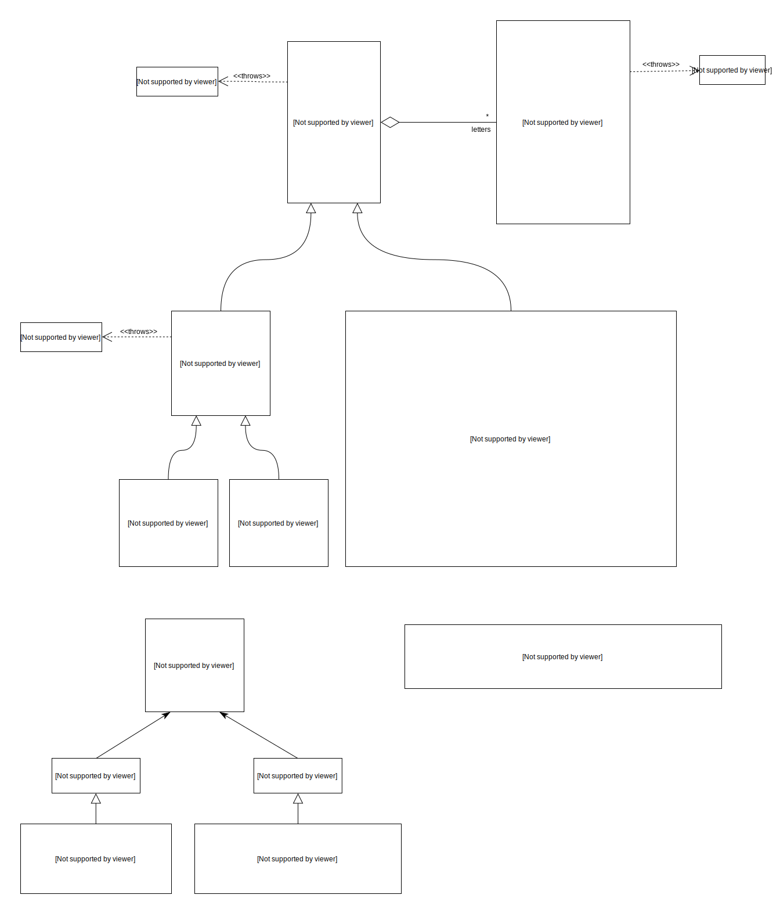

# Pronounceable anagrams switched to C#

To-do :
- [ ] Add some kind of sorting according to the quantity of successive consonants or vowels (for now, as long as "aa" is valid, "aaaaaa" is also valid)
- [ ] Find better bigram/trigram sets for french words
- [ ] Add an UI (using Unity ?)
- [ ] Study Markov chains and maybe add an option to generate words using this method
